# CS-Lightning-Learns-Team-6-Graphs 

# Graphs

## Definition
Graphs are a data structure that present objects and their connections as "nodes" and "edges" respectively.  Each node may have one or many edges connecting them to other nodes.  Two nodes with an edge between them are said to be 'adjacent'.  This method of viewing and visualizing data can be seen in many places both in software development as well as in the real world.

### Graphs - Nodes - Edges

#### Trees
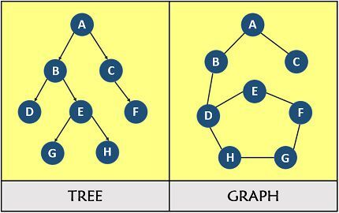

#### Road map
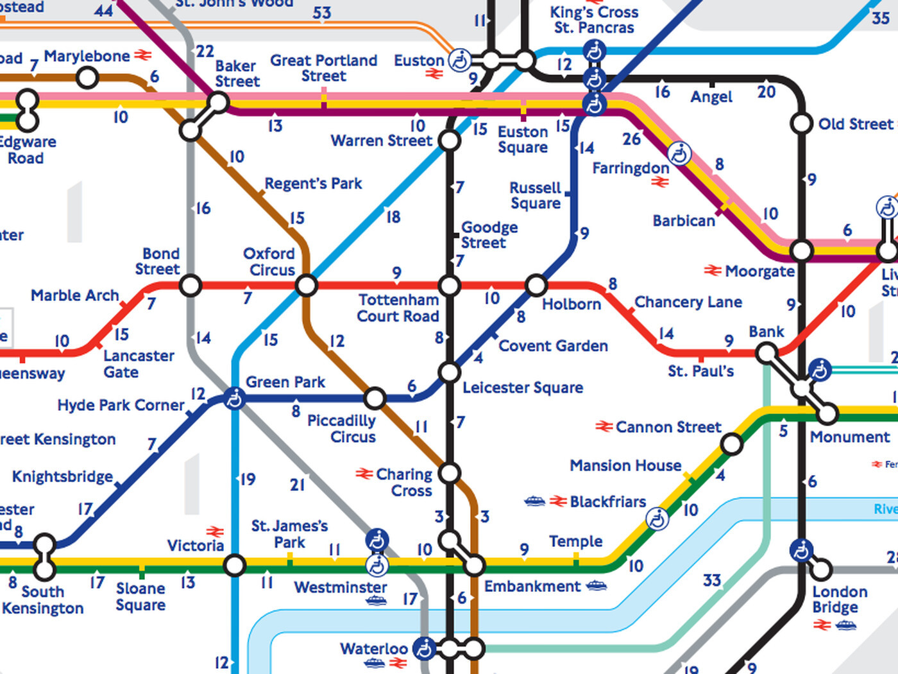

#### Social networks
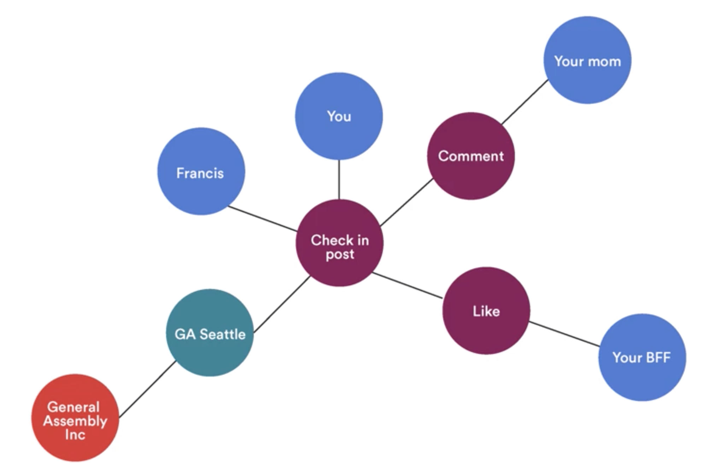

#### Students
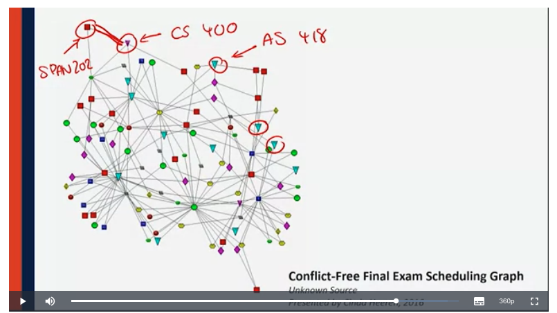

### Adjacency Lists and Matrices

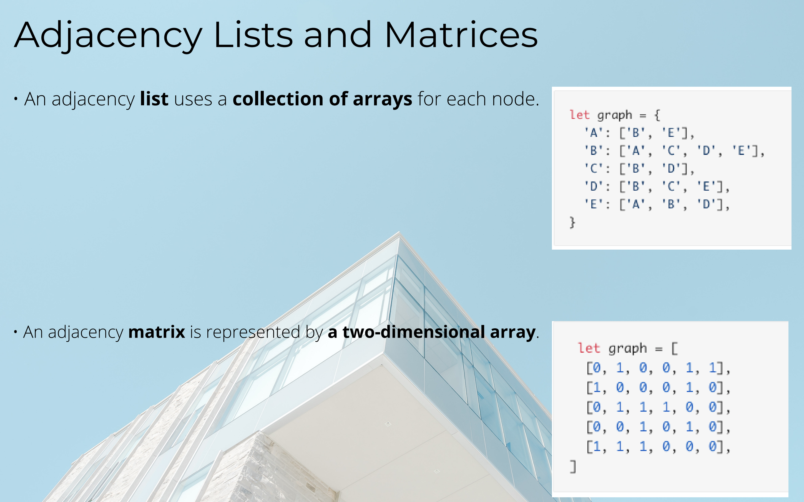

### Big O & Graphs

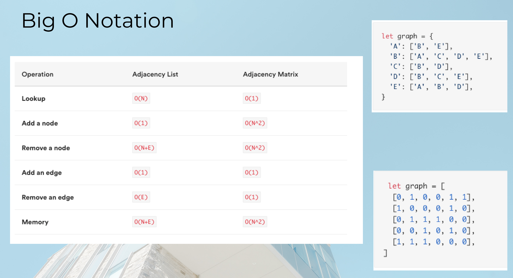

### Weighted Routes

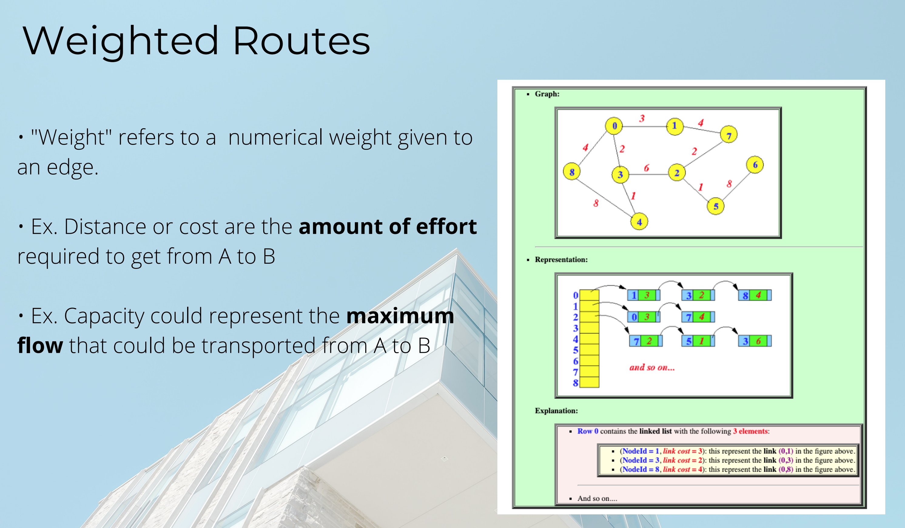

### Directed/Undirected Graphs

#### Directed

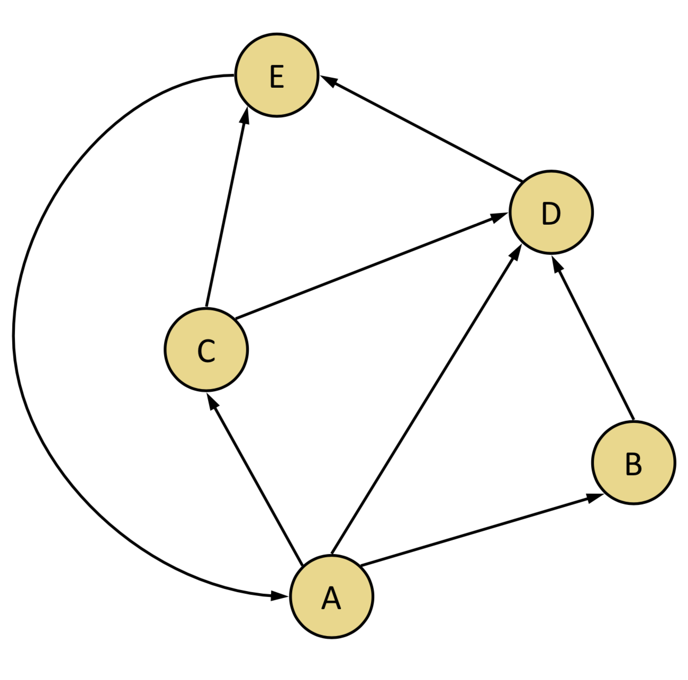

#### Undirected

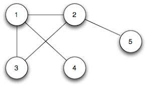

### Depth-First Search (DFS) and Breadth-First Search (BFS)

#### Depth-First

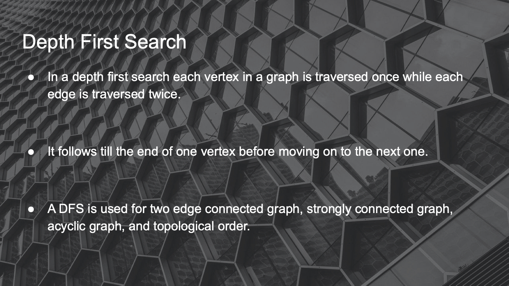

#### Breadth-First

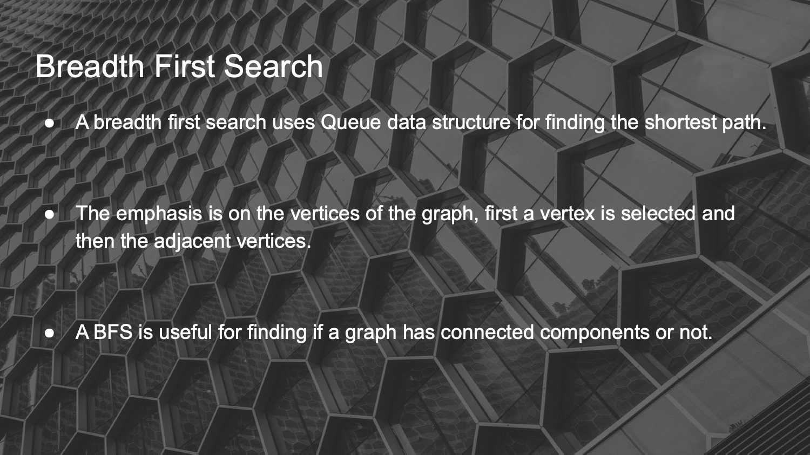

### Different types of questions that can be asked/solved on graphs:
- 1. Route Between Nodes: Given a directed graph and two nodes (S and E), design an algorithm to find out whether there is a route from S to E.

- 2. Shortest Path: For some pair of nodes, n1 and n2, find the shortest sequence fo edges < sN, dN > (source node and destination node), such that:
	+ The source node in the first edge is n1
	+ The destination node of the last edge is n2
	+ For all edges e1 and e2 in the sequence, if e2 follows e1 in the sequence, the source node of e2 is the destination node of e1.

- 3. Shortest weighted path: This is like the shortest path, except instead of choosing the shortest sequence of edges that connects two nodes, define a function on the weights of the edges in the sequence (e.g their sum) and minimize that value. This is the kind of problem solved by Google Maps when asked to compute driving directions between two points.